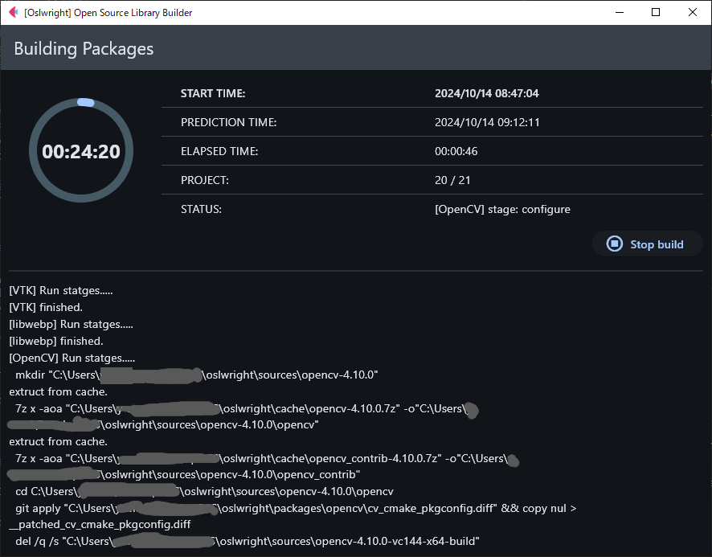
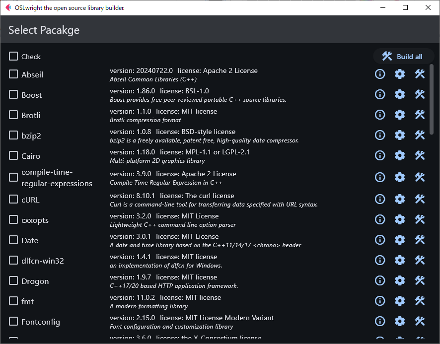

<h1>OSLwright: A C/C++ Open Source Library Builder for Windows</h1>
<p>
  
  <a href="#" target="_blank">
    
    
        
  </a>
</p>

OSLwright は、C/C++オープンソースライブラリ・ビルダーです。
Windows向けのC/C++ネイティブ・ライブラリをスクラッチビルドします。
<p>

</p>

<div style="border: 4px double yellow; padding: 10px; color: yellow;">
<p style="text-align: center;">現在、工事中！</p>
テストは実施していません。デフォルト設定以外ではビルドに失敗する場合があります。
</div>

# Features
* Windows向けにC/C++オープンソースライブラリをビルドします。
* GUIで簡単にパッケージのビルドが出来ます。
* 気まぐれで商業利用に制限の少ないライセンスのパッケージを収集しています。
* ソースファイルをダウンロードしてスクラッチ・ビルドするので、バージョン管理やソースの追跡に向いています。
* __vcpkg__ を利用したくない場合や出来ない場合に向いています。

# Requirements

次のアプリケーションをインストールしてください。

* Python 3.12 or higher [https://www.python.org/downloads/](https://www.python.org/downloads/)
* Microsoft Visual Studio 2022 or higher [https://visualstudio.microsoft.com/ja/downloads/](https://visualstudio.microsoft.com/ja/downloads/)
* CMake 3.30 or higher [https://cmake.org/download/](https://cmake.org/download/)
* Git for Windows [https://gitforwindows.org/](https://gitforwindows.org/)
* Git Large File Storage [https://git-lfs.com/](https://git-lfs.com/)
* 7zip [https://www.7-zip.org/download.html](https://www.7-zip.org/download.html)

# Get start
1. Python, VisualStudioなどOSLwrightが依存するアプリケーションをインストールします。
1. OSLwrightを起動します。<br>python仮想環境が作成されOSLwrightが起動します。
   ```dos
   > launch-oslwright.bat
   ```
1. 追加ツールダイアログが表示された場合は「Install tools」ボタンを押してください。

1. ビルドする対象のパッケージを選択します。

   

1. [Build all] を押すと、選択されたパッケージが順次ビルドされます。

1. ビルドされたパッケージは、&lt;OSLwright ディレクトリ&gt;/dist/以下にインストールされます。

# How to use the packages
パッケージを使用するには、いくつかの方法があります。

## A. パッケージをアプリケーションの開発フォルダへコピーして使用する方法
開発メンバーで開発環境を共有する場合に適しています。

1. 使用したいパッケージフォルダを&lt;開発フォルダ&gt;/3rdparty以下にコピーする。
    ```dos
    > cd <workdir>
    > xcopy <OSLwright>\dist 3rdparty /E /H /C /I
    ```
1. &lt;OSLwright ディレクトリ&gt;の cmake フォルダを&lt;開発フォルダ&gt;へコピーする。
    ```dos
    > cd <workdir>
    > xcopy <OSLwright>\cmake cmake /E /H /C /I
    ```
1. CMakeLists.txt に oslwrite module をロードするコードを記述する
    ```cmake
    # oslwrite module load
    include(${CMAKE_SOURCE_DIR}/cmake/oslwright.cmake)
    set(CMAKE_PREFIX_PATH "${OSLW_FRAMEWORK_PATH}")
    ```
## B. CMAKE_TOOLCHAIN_FILEを設定してパッケージを使用する方法

1. CMakeLists.txtに、CMAKE_PREFIX_PATHの設定を記述する
    ```cmake
    # oslwrite framework path
    set(CMAKE_PREFIX_PATH "${OSLW_FRAMEWORK_PATH}")
    ```
1. オプションにCMAKE_TOOLCHAIN_FILEを設定しcmake コマンドを実行する
    ```dos
    > cmake.exe -G "Visual Studio 17 2022" -A x64 -DCMAKE_TOOLCHAIN_FILE="<OSLwright>/cmake/oslwright.cmake" -S . -B .\build_64
    ```
# Functions
DLLが再帰的な依存関係を有する場合は、cmakeは参照先のDLLを発見できません。<br>
依存するDLLのコピーをサポートする関数を定義しました。

## oslw_copy_depdll
ターゲットに依存するDLLを\$&lt;TARGET_FILE_DIR:\${target}&gt;へコピーする
```cmake
oslw_copy_depdll(TARGET   <target>       target name
                 [PATH    <directories>] Semicolon-separated list of OSLW's package directories.
                 [EXCLUDE <dll-list>]    exclude dll list
                )
```
Example
```cmake
# copy external dlls to bindir.
oslw_copy_depdll(
  TARGET ${target_name}
)
```
## oslw_install_depdll
ターゲットに依存するDLLをインストールする
```cmake
oslw_install_depdll(TARGET      <target>       target name
                   [DESTINATION <dir>]         Specify the directory which files will be installed.
                   [COMPONENT   <component>]   Specify an installation component name.
                   [PATH        <directories>] Semicolon-separated list of OSLW's package directories.
                   [EXCLUDE     <dll-list>]    exclude dll list
                   )
```
Exmaple
```cmake
# install external dlls
oslw_install_depdll(
  TARGET ${target_name}
  DESTINATION bin
  COMPONENT Application
)
```
## oslw_find_depdll
DLLが依存するDLLのパスを検索する。
```cmake
oslw_find_depdll(<VARNAME>                variable is assigned the result.
                  DLLS     <dll paths>    Semicolon-separated list of DLLs path.
                  [PATH    <directories>] Semicolon-separated list of OSLW's package directories.
                  [EXCLUDE <dll-list>]    exclude dll list
                  [WORKDIR <directory>]   workinng directory
                 )
```
Exmaple
```cmake
# find dependent dlls and copy
set(PLUGINS_DLLS a.dll b.dll)
oslw_find_depdll(DEPENDENT_DLLS
  DLLS ${PLUGINS_DLLS}
  WORKDIR ${PLUGINS_PATH}
)
add_custom_command(TARGET ${target_name} POST_BUILD
                      COMMAND ${CMAKE_COMMAND} -E copy_if_different
                      ${DEPENDENT_DLLS}
                      "$<TARGET_FILE_DIR:${target_name}>"
                      COMMAND_EXPAND_LISTS)

```
# Note
* OSLwrightは、デフォルトでMSVCランタイムライブラリのコンパイルオプションはMultiThreadedDLL(/MD)を設定し、リリース版をビルドしています。<br>
開発するアプリケーションにおいて、MSVCランタイムライブラリのコンパイルオプションの設定は、リリース・デバックの両方ともにMultiThreadedDLL(/MD)へ変更してください。


# License
OSLwright のライセンスは MIT License です。<br>
サンプルソースコードのライセンスは UNLICENSEです。<br>
各パッケージは、それぞれのライセンスに従ってください。

# Appendix
## ファルダ命名規則(Folder naming conventions)
インストールされたパッケージのファルダ名は、次の命名規則に従います。
<br>
&lt;package&gt;-&lt;version&gt;[-&lt;arch&gt;][-&lt;vc-version&gt;][-&lt;vc-runtime&gt;][-&lt;cu-versoin&gt;][-static][-debug|-release]

  |Folder name|Mean|
  |----|----|
  |&lt;package&gt;-&lt;version&gt;-x64-vc144-md|A 64-bit build with either both release and debug configurations or release only, and either both shared and static libraries or shared libraries only.|
  |&lt;package&gt;-&lt;version&gt;-x64-vc144-md-cu124|with cuda|
  |&lt;package&gt;-&lt;version&gt;-x64-vc144-md-static|static library only|
  |&lt;package&gt;-&lt;version&gt;-x64-vc144-md-release|release only|
  |&lt;package&gt;-&lt;version&gt;-x64-vc144-md-debug|debug only|
  |&lt;package&gt;-&lt;version&gt;| header  only|
